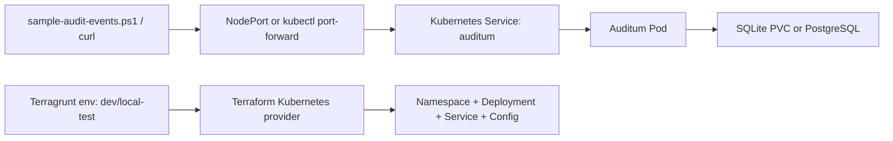

# auditum-demo

Local Kubernetes demo for deploying [Auditum](https://github.com/auditumio/auditum) with Terraform and Terragrunt.

The repo provides two reproducible targets:

1. `dev`
   For individual developers using `k3d`.
   Uses SQLite on a PVC to keep the setup minimal.
2. `local-test`
   For a shared Linux VM using `microk8s`.
   Uses PostgreSQL plus an Auditum migration Job for a more durable shared target.

## Purpose

This demo proves that Auditum can be deployed as a simple audit-log ingestion service in Kubernetes without Helm and without adding unnecessary infrastructure. It focuses on the minimum moving parts needed to:

1. start a local cluster
2. apply infrastructure with Terragrunt and Terraform
3. expose the Auditum HTTP API
4. ingest sample audit records over HTTP
5. inspect stored records with the Auditum API

## Architecture



The source for the onboarding diagram also lives in [docs/diagrams/overview.mmd](/c:/Dev/Git/GitHub/auditum-demo/docs/diagrams/overview.mmd).

## Prerequisites

- Docker
- `k3d`
- `kubectl`
- Terraform
- Terragrunt
- PowerShell 7+ recommended
- `microk8s` for the `local-test` target

## Repository Layout

```text
auditum-demo/
├── README.md
├── .gitignore
├── terragrunt.hcl
├── docs/
│   └── diagrams/
│       └── overview.mmd
├── envs/
│   ├── dev/terragrunt.hcl
│   └── local-test/terragrunt.hcl
├── scripts/
│   ├── sample-audit-events.ps1
│   ├── smoke-test.ps1
│   └── smoke-test.sh
└── terraform/
    ├── main.tf
    ├── outputs.tf
    ├── providers.tf
    ├── variables.tf
    ├── versions.tf
    └── modules/
        ├── auditum/
        │   ├── main.tf
        │   ├── outputs.tf
        │   └── variables.tf
        └── postgres/
            ├── main.tf
            ├── outputs.tf
            └── variables.tf
```

## Deploy To `dev` With `k3d`

Create the cluster:

```powershell
k3d cluster create auditum-dev --agents 1 --wait
```

Deploy Auditum from the `dev` target folder:

```powershell
Set-Location .\envs\dev; terragrunt apply
kubectl get pods -n auditum-demo
```

If the cluster already exists, skip the `k3d cluster create` command and just run `terragrunt apply` from `envs/dev`.

Access Auditum from your workstation with port-forwarding:

```powershell
kubectl port-forward service/auditum 8080:8080 -n auditum-demo
```

In another shell:

```powershell
./scripts/smoke-test.ps1 -BaseUrl http://localhost:8080
./scripts/sample-audit-events.ps1 -BaseUrl http://localhost:8080 -TenantId demo-tenant -ActorUserId user-123 -IncidentCaseIndex INC-2026-000123
```

Notes for `dev`:

- The `dev` environment defaults to `k3d-auditum-dev`.
- It uses `ClusterIP` plus `kubectl port-forward`.
- It stores data in SQLite at `/data/auditum.db` on a PVC.
- The `dev` target explicitly uses the `local-path` storage class.
- Terragrunt for `dev` clears `HTTP_PROXY` and `HTTPS_PROXY` for Terraform so local `k3d` API access is not routed through a corporate proxy by accident.
- The happy-path workflow is: create cluster, run `terragrunt apply` from `envs/dev`, then port-forward and test.

## Deploy To `local-test` With `microk8s`

Prepare `microk8s` on the shared VM:

```bash
microk8s status --wait-ready
microk8s enable dns storage
```

Deploy Auditum:

```bash
cd envs/local-test && terragrunt apply
kubectl get pods -n auditum-demo
kubectl get svc -n auditum-demo
```

Notes for `local-test`:

- The environment defaults to kube context `microk8s`.
- It uses `NodePort` by default on port `30080`.
- It deploys PostgreSQL in-cluster and runs `auditum migrate` before the Auditum Deployment starts.

If you export a kubeconfig file instead of using the default `microk8s` context, set:

```bash
export AUDITUM_LOCAL_TEST_KUBECONFIG=/path/to/microk8s.config
export AUDITUM_LOCAL_TEST_KUBECONTEXT=microk8s
```

## Access Auditum

For `dev`:

```powershell
kubectl port-forward service/auditum 8080:8080 -n auditum-demo
```

For `local-test`:

```bash
kubectl get svc auditum -n auditum-demo
curl http://<vm-or-node-ip>:30080/metrics
```

## Test The Deployment

There are two distinct tests in this repo:

1. `smoke-test`
   Verifies that the Auditum HTTP service is reachable and that the API can answer a simple `projects` query.
   This is the first check after deployment and should succeed before sending any sample events.
2. `sample-audit-events`
   Verifies that Auditum can accept writes, create or reuse a project, and store a realistic batch of audit records.
   This is the functional ingestion test.

Recommended test order for `dev`:

```powershell
kubectl port-forward service/auditum 8080:8080 -n auditum-demo
```

In a second shell:

```powershell
./scripts/smoke-test.ps1 -BaseUrl http://localhost:8080
./scripts/sample-audit-events.ps1 -BaseUrl http://localhost:8080 -TenantId demo-tenant -ActorUserId user-123 -IncidentCaseIndex INC-2026-000123
```

Recommended test order for `local-test`:

```bash
./scripts/smoke-test.sh http://<vm-or-node-ip>:30080
pwsh ./scripts/sample-audit-events.ps1 -BaseUrl http://<vm-or-node-ip>:30080 -TenantId demo-tenant -ActorUserId user-123 -IncidentCaseIndex INC-2026-000123
```

### What `smoke-test` checks

The smoke test is intentionally small and fast. It checks:

- `GET /metrics`
  Expected result: HTTP `200`.
  Why it matters: confirms the pod is reachable and the HTTP listener is up.
- `GET /api/v1alpha1/projects?page_size=1`
  Expected result: HTTP `200` with a JSON payload, even if the list is empty.
  Why it matters: confirms the application API is alive, not just the TCP socket.

If this test fails, fix connectivity or deployment issues before trying to ingest records.

### What `sample-audit-events.ps1` checks

The PowerShell event script:

- reuses an existing Auditum project when `external_id == TenantId`
- creates the project if it does not already exist
- submits five sample records:
  - `incident.viewed`
  - `owner-data.viewed`
  - `evidence.downloaded`
  - `workflow.authorization-approved`
  - `access.denied`
- prints the HTTP status and response body for each API call
- generates a W3C-style `traceparent` value for every record batch

Expected result:

- project lookup returns `200`
- project creation returns `200` if the project does not yet exist
- batch record creation returns `200`
- the script prints `Using Project ID: ...`
- you can query records afterward and see the five submitted demo records

Example:

```powershell
./scripts/sample-audit-events.ps1 `
  -BaseUrl http://localhost:8080 `
  -TenantId demo-tenant `
  -ActorUserId user-123 `
  -IncidentCaseIndex INC-2026-000123
```

## Inspect Stored Audit Events

List projects:

```bash
curl --silent --header "Accept: application/json+pretty" \
  "http://localhost:8080/api/v1alpha1/projects?page_size=10"
```

List records for one project:

```bash
curl --silent --header "Accept: application/json+pretty" \
  "http://localhost:8080/api/v1alpha1/projects/<project-id>/records?page_size=20"
```

The sample PowerShell script prints the project ID it uses, which you can plug into the records query above.

For a quick end-to-end confirmation after running the sample event script, you should see:

- one project whose `external_id` matches your `TenantId`
- five new records for that project
- record metadata that includes the demo action names such as `incident.viewed` and `access.denied`

## Configuration

Shared defaults live in [terragrunt.hcl](/c:/Dev/Git/GitHub/auditum-demo/terragrunt.hcl).

Environment-specific values live in:

- [envs/dev/terragrunt.hcl](/c:/Dev/Git/GitHub/auditum-demo/envs/dev/terragrunt.hcl)
- [envs/local-test/terragrunt.hcl](/c:/Dev/Git/GitHub/auditum-demo/envs/local-test/terragrunt.hcl)

The following are configurable through Terragrunt inputs:

- kubeconfig path
- kube context
- namespace
- Auditum image repository and tag
- service type
- NodePort
- SQLite PVC size
- PostgreSQL storage settings

## Troubleshooting

`terragrunt apply` cannot reach the cluster:
Check the kubeconfig path and context configured in the environment `terragrunt.hcl`.

`terragrunt apply` in `dev` fails because the context is missing:
Run `kubectl config get-contexts` and confirm that `k3d-auditum-dev` exists after cluster creation.

`kubectl` against the `k3d` cluster fails with `proxyconnect tcp` or `host.docker.internal` errors:
Your shell proxy settings are likely intercepting local cluster traffic.
For PowerShell, use:

```powershell
$env:NO_PROXY = "localhost,127.0.0.1,::1,host.docker.internal,kubernetes.docker.internal"
```

Auditum pod is pending on `local-test`:
Verify the `microk8s storage` addon is enabled and that a default storage class exists.

Auditum migration Job fails:
Inspect logs with:

```bash
kubectl logs job/auditum-migrate -n auditum-demo
```

Port-forward works but writes fail:
Inspect the Auditum pod logs and verify the SQLite PVC is writable in `dev` or PostgreSQL is healthy in `local-test`.

NodePort is unreachable on the shared VM:
Check the VM firewall and confirm that `30080/TCP` is open.

## Cleanup

For `dev`, remove the deployed resources from the target folder:

```powershell
Set-Location .\envs\dev; terragrunt destroy
```

Then remove the cluster:

```powershell
k3d cluster delete auditum-dev
```

For `local-test`, remove the deployed resources from the target folder:

```bash
cd envs/local-test && terragrunt destroy
```

If you want to remove the `microk8s` demo namespace manually after destroy:

```bash
kubectl delete namespace auditum-demo
```

## Production Notes And Limitations

- This repo is intentionally a local demo, not a hardened production platform.
- `dev` uses SQLite for minimal setup and single-replica convenience.
- `local-test` uses a single PostgreSQL pod and a single Auditum replica.
- No ingress controller, TLS termination, auth layer, network policies, backup flow, or HA design is included.
- Kubernetes probes use `GET /metrics` because that endpoint is documented upstream. A dedicated health endpoint was not found in the reviewed docs.
- The sample events map business actions like `incident.viewed` into Auditum’s `record.resource`, `record.operation`, and `record.actor` fields. That mapping is a demo convention, not an Auditum-specific domain model.

## Auditum API Assumption

The HTTP endpoints and payload structure used here are based on the published Auditum Quickstart, Usage Guide, OpenAPI reference, and the upstream container/configuration files.

The only notable assumption left in this demo is the probe path choice:

- readiness, liveness, and startup probes use `/metrics`
- if upstream later documents a dedicated health endpoint, replace the probe path in the Terraform module
